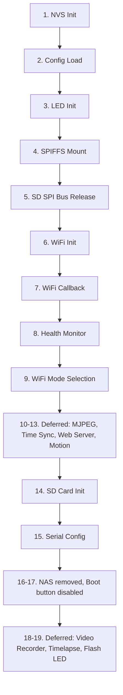

[](https://docs.espressif.com/projects/esp-idf/en/latest/esp32/)  
[](LICENSE)

> 🌐 [中文文档](../zh/architecture.md)

# Architecture

This document provides a comprehensive overview of the MiBee Cam firmware architecture, including module organization, boot sequence, data flow, and system design.

## System Overview

The MiBee Cam firmware is a real-time embedded system designed for camera applications with WiFi connectivity and storage capabilities. The architecture follows a modular design with clear separation of concerns.

### Key Characteristics

- **Real-time Processing**: Concurrent camera capture and streaming
- **Resource-Constrained**: Optimized for 4MB flash + 4MB PSRAM
- **Networked**: WiFi connectivity with AP/STA dual-mode
- **Modular**: 14 separate modules with defined interfaces
- **Event-Driven**: Asynchronous operation with state machines

## Module Architecture

The firmware consists of 14 interconnected modules, each with specific responsibilities:

```
┌─────────────────────────────────────────────────────────────┐
│                    Application Layer                          │
├─────────────────────────────────────────────────────────────┤
│  Web Server    │ MJPEG Streamer │ Motion Detect            │
│  (HTTP + API)  │   (Streaming)  │   (Capture)            │
├─────────────────────────────────────────────────────────────┤
│                    Hardware Interface Layer                  │
├─────────────────────────────────────────────────────────────┤
│  Camera Driver │  Storage Mgr  │   WiFi Mgr   │  Time Sync  │
│    (OV2640)     │  (SD Card)    │ (AP/STA)     │   (NTP)     │
├─────────────────────────────────────────────────────────────┤
│                    System Core Layer                         │
├─────────────────────────────────────────────────────────────┤
│  Config Manager │ Health Monitor │ Status LED │  Timelapse  │
│    (NVS)        │   (Metrics)   │   (GPIO)   │   (Control) │
├─────────────────────────────────────────────────────────────┤
│                  ESP-IDF Framework                           │
├─────────────────────────────────────────────────────────────┤
│  FreeRTOS      │ LWIP          │ SPIFFS      │ NVS         │
│  (Tasks/RTOS)  │  (Networking) │ (Storage)   │ (Config)    │
└─────────────────────────────────────────────────────────────┘
```

## Detailed Module Descriptions

### 1. Main Module (`main.c`)
**Responsibility**: System orchestration and boot sequence
- **Functions**: 19-step initialization, task coordination
- **Key Files**: `main.c`
- **Dependencies**: All other modules
- **Memory**: Stack size 8KB
- **Priority**: High (task creation and coordination)

### 2. Camera Driver (`camera_driver.c/h`)
**Responsibility**: OV2640 camera control and frame capture
- **Functions**: Initialization, JPEG capture, resolution control
- **Memory**: PSRAM for frame buffers
- **Critical**: Deferred after WiFi STA (DMA freeze workaround esp32-camera#620)
- **GPIO**: Uses camera-specific pins (XCLK=0, etc.)

### 3. WiFi Manager (`wifi_manager.c/h`)
**Responsibility**: WiFi connectivity management
- **Functions**: AP/STA mode, auto-reconnect, callback registration, serial AT config
- **Network**: Handles IP assignment and connectivity
- **Mode**: STA for operation, AP for fallback, configurable AP fallback behavior
- **Event**: State changes trigger other modules

### 4. Config Manager (`config_manager.c/h`)
**Responsibility**: Configuration persistence and management
- **Storage**: NVS key-value storage
- **Migration**: Auto-migration between versions (V1→V9)
- **Defaults**: Sensible defaults for first boot
- **Validation**: Configuration integrity checking

### 5. Web Server (`web_server.c/h`)
**Responsibility**: HTTP server and REST API
- **Ports**: TCP port 80
- **Endpoints**: Status, config, capture, stream, metrics, files, timelapse, flash, recording
- **Static Files**: Served from SPIFFS partition
- **Authentication**: Optional password protection for write operations

### 6. MJPEG Streamer (`mjpeg_streamer.c/h`)
**Responsibility**: Real-time video streaming
- **Protocol**: multipart/x-mixed-replace
- **Frame Rate**: Target 15 FPS with throttling
- **Clients**: Max 2 concurrent streams
- **Buffering**: Frame-based with double buffering

### 7. Storage Manager (`storage_manager.c/h`)
**Responsibility**: SD card photo storage
- **Interface**: SPI (SDSPI)
- **File System**: FAT32 via FatFs
- **Organization**: Date-based directories
- **Cleanup**: Circular when free space < 20%

### 8. Motion Detection (`motion_detect.c/h`)
**Responsibility**: Motion detection, brightness sensing, and auto-flash
- **Algorithm**: JPEG frame-difference with configurable threshold
- **Brightness**: Grayscale pixel probing (primary) + JPEG size fallback
- **Auto Flash**: LEDC PWM on GPIO4 (~80% duty, safe for MiBee hardware)
- **Trigger**: Save photo to SD card
- **Configurable**: Threshold, cooldown, flash_threshold (brightness %)

### 9. Status LED (`status_led.c/h`)
**Responsibility**: System status indication
- **GPIO**: GPIO33 (active LOW)
- **Patterns**: Different blink patterns for each state
- **States**: Starting, WiFi connecting, running, error, AP mode

### 10. Time Sync (`time_sync.c/h`)
**Responsibility**: Time and date management
- **Protocol**: SNTP with NTP server
- **Timezone**: Configurable POSIX timezone
- **Accuracy**: Synchronized within 1 second
- **Use Case**: Timestamps for photos and logs

### 11. Health Monitor (`health_monitor.c/h`)
**Responsibility**: System health tracking
- **Metrics**: Heap, PSRAM, task stack usage
- **Output**: Prometheus-compatible /metrics endpoint
- **Interval**: 60-second monitoring
- **Logging**: Periodic health reports

### 12. Video Recorder (`video_recorder.c/h`)
**Responsibility**: AVI video recording with multiple modes
- **Modes**: Continuous, timelapse, dynamic
- **Storage**: Segmented AVI files on SD card
- **Config**: Record mode, segment duration

### 13. Timelapse Module (`timelapse.c/h`)
**Responsibility**: Periodic and motion-triggered capture control
- **Features**: Configurable intervals, burst capture, motion integration
- **Storage**: SD card with timestamped filenames
- **API**: Start/stop/status endpoints
- **Integration**: Works with camera driver and storage manager

### 14. Flash LED (`flash_led.c/h`)
**Responsibility**: Flash LED control and state tracking
- **GPIO**: GPIO4 with PWM brightness control
- **Modes**: Manual toggle, automatic brightness-based activation
- **API**: Get/set status endpoints
- **Integration**: Motion detection triggers auto-activation

### 15. Serial Config (`serial_config.c/h`)
**Responsibility**: Serial AT command configuration interface
- **Commands**: AT+WIFI configuration via serial port
- **Use Case**: Headless configuration without network access
- **Protocol**: Custom AT command parser

### 16. Common (`common.h`)
**Responsibility**: Shared types, pin definitions, config struct
- **Pin Mappings**: CAM_PIN_*, SD_PIN_*
- **Config Struct**: cam_config_t (V9)
- **Enums**: wifi_state_t, led_state_t

## Boot Sequence

The firmware follows a carefully ordered 19-step boot sequence to avoid hardware conflicts and ensure proper initialization:



### Boot Step Details

**Steps 1-4: Foundation**
- NVS initialization for configuration
- LED setup for visual feedback
- SPIFFS mount for web UI

**Steps 5-8: Hardware Setup**
- SD SPI bus release (GPIO14 sharing)
- WiFi subsystem setup
- Health monitoring start
- WiFi mode selection (STA if configured, AP otherwise)

**Steps 9-14: Network Services**
- MJPEG streaming (deferred to WiFi connect in STA)
- Time sync (deferred to WiFi connect)
- Web server (port 80)
- Motion detection (deferred to WiFi connect)
- SD card init (after camera, GPIO14 conflict)
- Serial config (AT commands)

**Steps 15-19: Application Services**
- NAS uploader removed, boot button disabled
- Video recorder (deferred STA services task)
- Timelapse & flash LED (deferred STA services task)

## Data Flow Architecture

### Camera Data Flow
```
OV2640 Camera → Camera Driver → Frame Buffer
    ↓
JPEG Encoding → MJPEG Streamer → Network Client
    ↓
Storage Manager → SD Card (Photos)
    ↓
    ↓
Motion Detection → SD Card Storage + Flash LED
```

### Network Data Flow
```
WiFi Interface → LWIP Stack → Web Server
    ↓
HTTP Request → REST API → Module Handler
    ↓
Response → Client Browser/Mobile Device
```

### Configuration Data Flow
```
Web UI → HTTP POST → Web Server → Config Manager
    ↓
NVS Storage → Config Manager → Runtime Modules
    ↓
Runtime Changes → Config Manager → NVS Update
```

## Memory Architecture

### Flash Memory (4MB)
```
0x00000-0x0FFFF:    Bootloader (92KB)
0x10000-0x25FFFF:   Application (~2.5MB)
0x260000-0x3DFFFF:  SPIFFS (~1.2MB)
0x3E0000-0x3FFFFF:  NVS (24KB)
```

### PSRAM (4MB)
```
0x000000-0x1EFFFF:  Camera Frame Buffers (2MB)
0x1F0000-0x3FFFFF:  Available for Other Use (2MB)
```

### Stack Memory
- **Main Task**: 8KB (boot sequence)
- **WiFi Task**: 8KB (network operations)
- **Camera Task**: 8KB (capture operations)
- **Background Tasks**: 4KB each (monitoring, etc.)

## Concurrency Model

### Task Overview
```c
// Main Task (main.c)
- Boot sequence orchestration
- Module initialization
- System coordination

// WiFi Task (wifi_manager.c)
- Network connectivity management
- Background operations

// Camera Task (camera_driver.c)
- Camera capture operations
- Frame processing

// HTTP Server Task (web_server.c)
- HTTP request handling
- Web UI serving

// Background Tasks
- Health monitoring (60s interval)
- Motion detection (continuous)

- SD card monitoring (hot-plug detection)
- Timelapse control (periodic)
- Flash LED control (PWM)
- Video recording (segmented)
```

### Synchronization Primitives

#### Mutexes
- **Camera Access**: Protects frame buffer access
- **SD Card Access**: Prevents GPIO14 conflicts
- **Config Access**: Thread-safe configuration access

#### Semaphores
- **Stream Clients**: Limits concurrent streams (max 2)
- **Upload Queue**: Synchronizes upload processing
- **WiFi Events**: Synchronizes state changes

#### FreeRTOS Features
- **Queues**: Intertask communication
- **Timers**: Periodic task execution
- **Event Groups**: Async event handling

## Error Handling and Recovery

### Error Categories
1. **Hardware Errors**: Camera init failure, SD card errors
2. **Network Errors**: WiFi disconnection, upload failures
3. **Resource Errors**: Memory exhaustion, stack overflow
4. **Configuration Errors**: Invalid settings, NVS corruption

### Recovery Strategies
- **WiFi**: Auto-reconnect with exponential backoff
- **Camera**: Soft reset and reinitialization
- **SD Card**: Remount and retry operations
- **System**: Watchdog timer for task recovery

### Error Indicators
- **LED Patterns**: Different blink sequences for error types
- **Serial Logging**: Detailed error messages with timestamps
- **Web Dashboard**: Error status indicators
- **API Responses**: HTTP error codes with details

## Performance Characteristics

### CPU Usage
- **Idle**: ~2% CPU utilization
- **Streaming**: ~40% CPU at 15 FPS VGA
- **Motion Detection**: ~5% CPU continuous
- **Recording**: ~25% CPU during AVI encoding

### Memory Usage
- **Free Heap**: Minimum 20KB required
- **PSRAM**: Camera uses 600KB-2.4MB depending on resolution
- **Stack**: Main task 8KB, other tasks 4KB-8KB
- **Static**: ~50KB for compiled code

### Network Performance
- **MJPEG Stream**: 15 FPS VGA (~500KB/s)
- **HTTP API**: <100ms response time
- **WiFi Throughput**: ~1-2 Mbps sustained
- **Recording**: ~1 Mbps continuous AVI output

## GPIO and Hardware Constraints

### Critical Constraints
1. **GPIO14 Sharing**: Camera XCLK / SD Card CLK requires time-multiplexing
2. **I2C Bus Conflict**: Camera and WiFi cannot use I2C simultaneously
3. **Input-Only GPIOs**: 34,35,36,39 cannot be used as outputs
4. **LED Polarity**: GPIO33 is active LOW, GPIO4 flash LED is active HIGH

### Hardware Resource Management
- **PSRAM**: Dedicated to camera frame buffers
- **Flash**: Carefully partitioned for firmware + storage
- **SPI Bus**: Shared between camera and SD card (time-multiplexed)
- **Power Management**: Dynamic clock scaling for power efficiency

## Extensibility and Customization

### Module Interfaces
All modules follow consistent interface patterns:
- **Init/Deinit**: Standard lifecycle methods
- **Configuration**: Centralized config management
- **Error Handling**: Consistent error reporting
- **Logging**: Structured logging with levels

### Configuration Options
- **Feature Gates**: Kconfig-based feature selection
- **Runtime Configuration**: Dynamic parameter adjustment
- **Persistent Settings**: NVS-based configuration persistence
- **Web Interface**: User-friendly configuration management

### Extension Points
- **Additional Cameras**: Interface abstraction for different sensors
- **Storage Systems**: Plugin architecture for different backends
- **Network Protocols**: Extensible upload framework
- **Web UI**: Modular HTML/CSS/JavaScript structure