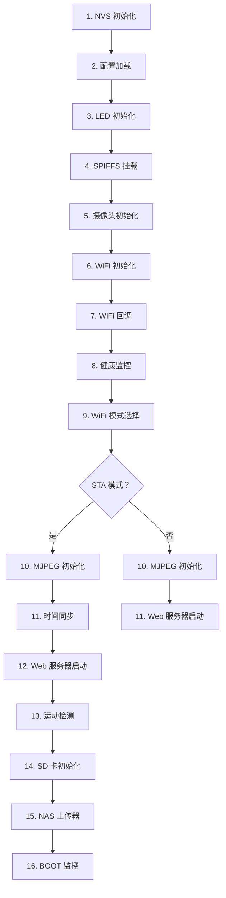

> 🌐 [English Documentation](../en/architecture.md)

# 架构

本文档提供 AI_Thinker ESP32-CAM 固件的全面架构概述，包括模块组织、启动序列、数据流和系统设计。

## 系统概述

AI_Thinker ESP32-CAM 固件是一个专为摄像头应用程序设计的实时嵌入式系统，具有 WiFi 连接和存储功能。架构采用模块化设计，具有清晰的关注点分离。

### 关键特性

- **实时处理**：并发摄像头捕获和流传输
- **资源受限**：针对 4MB 闪存 + 4MB PSRAM 进行优化
- **联网**：带有 AP/STA 双模式的 WiFi 连接性
- **模块化**：14 个独立模块，具有定义的接口
- **事件驱动**：具有状态机的异步操作

## 模块架构

固件由 14 个相互连接的模块组成，每个模块具有特定职责：

```
┌─────────────────────────────────────────────────────────────┐
│                    应用程序层                              │
├─────────────────────────────────────────────────────────────┤
│  Web 服务器    │ MJPEG 流传输器 │ 运动检测 │ NAS 上传器  │
│  (HTTP + API)  │   (流传输)    │   (捕获) │   (上传)   │
├─────────────────────────────────────────────────────────────┤
│                    硬件接口层                             │
├─────────────────────────────────────────────────────────────┤
│  摄像头驱动器  │  存储管理器  │   WiFi 管理器 │  时间同步  │
│    (OV2640)     │  (SD 卡)     │ (AP/STA)    │   (NTP)    │
├─────────────────────────────────────────────────────────────┤
│                    系统核心层                             │
├─────────────────────────────────────────────────────────────┤
│  配置管理器    │ 健康监控器   │ 状态 LED │     主程序   │
│    (NVS)       │   (指标)     │   (GPIO) │ (启动序列) │
├─────────────────────────────────────────────────────────────┤
│                  ESP-IDF 框架                            │
├─────────────────────────────────────────────────────────────┤
│  FreeRTOS      │ LWIP         │ SPIFFS   │ NVS        │
│  (任务/RTOS)   │  (网络)      │ (存储)   │ (配置)     │
└─────────────────────────────────────────────────────────────┘
```

## 详细模块描述

### 1. 主模块（`main.c`）
**职责**：系统协调和启动序列
- **功能**：16 步初始化，任务协调
- **文件**：`main.c`
- **依赖项**：所有其他模块
- **内存**：堆栈大小 8KB
- **优先级**：高（任务创建和协调）

### 2. 摄像头驱动器（`camera_driver.c/h`）
**职责**：OV2640 摄像头控制和帧捕获
- **功能**：初始化、JPEG 捕获、分辨率控制
- **内存**：PSRAM 用于帧缓冲
- **关键**：必须在 WiFi 之前初始化（I2C 总线冲突）
- **GPIO**：使用摄像头特定引脚（XCLK=0 等）

### 3. WiFi 管理器（`wifi_manager.c/h`）
**职责**：WiFi 连接管理
- **功能**：AP/STA 模式、自动重连、回调注册
- **网络**：处理 IP 分配和连接性
- **模式**：操作使用 STA，回退使用 AP
- **事件**：状态变化触发其他模块

### 4. 配置管理器（`config_manager.c/h`）
**职责**：配置持久化和管理
- **存储**：NVS 键值存储
- **迁移**：版本间自动迁移
- **默认值**：首次启动的合理默认值
- **验证**：配置完整性检查

### 5. Web 服务器（`web_server.c/h`）
**职责**：HTTP 服务器和 REST API
- **端口**：TCP 端口 80
- **端点**：状态、配置、捕获、流、指标、文件
- **静态文件**：从 SPIFFS 分区提供服务
- **认证**：写操作的密码保护（可选）

### 6. MJPEG 流传输器（`mjpeg_streamer.c/h`）
**职责**：实时视频流传输
- **协议**：multipart/x-mixed-replace
- **帧率**：目标 15 FPS，带限流
- **客户端**：最多 2 个并发流
- **缓冲**：基于帧的双缓冲

### 7. 存储管理器（`storage_manager.c/h`）
**职责**：SD 卡照片存储
- **接口**：SPI（SDSPI）
- **文件系统**：通过 FatFs 的 FAT32
- **组织**：基于日期的目录
- **清理**：当可用空间 < 20% 时循环清理

### 8. 运动检测（`motion_detect.c/h`）
**职责**：运动检测、亮度感知和自动闪光
- **算法**：基于 JPEG 帧差，可配置阈值
- **亮度检测**：灰度像素探测（主要）+ JPEG 大小回退
- **自动闪光**：GPIO4 LEDC PWM（~80% 占空比，AI-Thinker 硬件安全值）
- **触发**：保存照片 + 上传到 NAS
- **可配置**：阈值、冷却时间、flash_threshold（亮度百分比）

### 9. NAS 上传器（`nas_uploader.c/h`）
**职责**：后台文件上传
- **协议**：HTTP/WebDAV
- **队列**：异步上传处理
- **重试**：3 次尝试，指数退避
- **集成**：与运动检测协同工作

### 11. WebDAV 客户端（`webdav_client.c/h`）
**职责**：WebDAV 协议实现
- **方法**：带认证的 PUT
- **标头**：Content-Type 和授权
- **集成**：HTTP 上传替代方案

### 12. 状态 LED（`status_led.c/h`）
**职责**：系统状态指示
- **GPIO**：GPIO33（低电平有效）
- **模式**：每种状态的不同闪烁模式
- **状态**：启动、WiFi 连接、运行、错误、AP 模式

### 13. 时间同步（`time_sync.c/h`）
**职责**：时间和日期管理
- **协议**：使用 NTP 服务器的 SNTP
- **时区**：可配置的 POSIX 时区
- **准确性**：在 1 秒内同步
- **用例**：照片和日志的时间戳

### 14. 健康监控器（`health_monitor.c/h`）
**职责**：系统健康跟踪
- **指标**：堆栈、PSRAM、任务堆栈使用情况
- **输出**：兼容 Prometheus 的 /metrics 端点
- **间隔**：60 秒监控
- **日志记录**：定期健康报告

## 启动序列

固件遵循仔细排序的 16 步启动序列，以避免硬件冲突并确保正确初始化：



### 启动步骤详情

**步骤 1-4：基础**
- NVS 初始化用于配置
- LED 设置用于视觉反馈
- SPIFFS 挂载用于 Web 界面

**步骤 5-8：硬件设置**
- 摄像头初始化（在 WiFi 之前以避免 I2C 冲突）
- WiFi 子系统设置
- 健康监控启动

**步骤 9-12：网络服务**
- WiFi 模式选择（如果已配置则 STA，否则 AP）
- MJPEG 流传输服务
- 时间同步（仅 STA 模式）

**步骤 13-16：应用程序服务**
- 运动检测（仅 STA 模式）
- SD 卡存储（在摄像头之后以处理 GPIO14 共享）
- NAS 上传服务
- 系统监控和控制

## 数据流架构

### 摄像头数据流
```
OV2640 摄像头 → 摄像头驱动器 → 帧缓冲
    ↓
JPEG 编码 → MJPEG 流传输器 → 网络客户端
    ↓
存储管理器 → SD 卡（照片）
    ↓
运动检测 → NAS 上传器 → 远程服务器
```

### 网络数据流
```
WiFi 接口 → LWIP 栈 → Web 服务器
    ↓
HTTP 请求 → REST API → 模块处理器
    ↓
响应 → 客户端浏览器/移动设备
```

### 配置数据流
```
Web 界面 → HTTP POST → Web 服务器 → 配置管理器
    ↓
NVS 存储 → 配置管理器 → 运行时模块
    ↓
运行时更改 → 配置管理器 → NVS 更新
```

## 内存架构

### 闪存（4MB）
```
0x00000-0x0FFFF:    引导加载程序 (92KB)
0x10000-0x25FFFF:   应用程序 (~2.5MB)
0x260000-0x3DFFFF:  SPIFFS (~1.2MB)
0x3E0000-0x3FFFFF:  NVS (24KB)
```

### PSRAM（4MB）
```
0x000000-0x1EFFFF:  摄像头帧缓冲区 (2MB)
0x1F0000-0x3FFFFF:  其他使用可用 (2MB)
```

### 堆栈内存
- **主任务**：8KB（启动序列）
- **WiFi 任务**：8KB（网络操作）
- **摄像头任务**：8KB（捕获操作）
- **后台任务**：每个 4KB（监控等）

## 并发模型

### 任务概述
```c
// 主任务（main.c）
- 启动序列协调
- 模块初始化
- 系统协调

// WiFi 任务（wifi_manager.c）
- 网络连接管理
- 后台操作

// 摄像头任务（camera_driver.c）
- 摄像头捕获操作
- 帧处理

// HTTP 服务器任务（web_server.c）
- HTTP 请求处理
- Web 界面服务

// 后台任务
- 健康监控（60 秒间隔）
- 运动检测（连续）
- NAS 上传器（队列处理）
- SD 卡监控（热插拔检测）
```

### 同步原语

#### 互斥锁
- **摄像头访问**：保护帧缓冲访问
- **SD 卡访问**：防止 GPIO14 冲突
- **配置访问**：线程安全的配置访问

#### 信号量
- **流客户端**：限制并发流（最多 2 个）
- **上传队列**：同步上传处理
- **WiFi 事件**：同步状态变化

#### FreeRTOS 功能
- **队列**：任务间通信
- **定时器**：定期任务执行
- **事件组**：异步事件处理

## 错误处理和恢复

### 错误类别
1. **硬件错误**：摄像头初始化失败、SD 卡错误
2. **网络错误**：WiFi 断开连接、上传失败
3. **资源错误**：内存耗尽、堆栈溢出
4. **配置错误**：无效设置、NVS 损坏

### 恢复策略
- **WiFi**：指数退避的自动重连
- **上传**：3 次尝试的重试机制
- **摄像头**：软复位和重新初始化
- **系统**：用于任务恢复的看门狗定时器

### 错误指示器
- **LED 模式**：不同错误类型的不同闪烁序列
- **串口日志**：带时间戳的详细错误消息
- **Web 仪表板**：错误状态指示器
- **API 响应**：带有详细信息的 HTTP 错误代码

## 性能特征

### CPU 使用率
- **空闲**：约 2% CPU 利用率
- **流传输**：VGA 分辨率下 15 FPS，约 40% CPU
- **运动检测**：持续约 5% CPU
- **上传**：传输期间约 15% CPU

### 内存使用
- **空闲堆栈**：需要最少 20KB
- **PSRAM 使用**：根据分辨率摄像头使用 600KB-2.4MB
- **堆栈**：主任务 8KB，其他任务 4KB-8KB
- **静态**：编译代码约 50KB

### 网络性能
- **MJPEG 流**：15 FPS VGA，约 500KB/s
- **HTTP API**：<100ms 响应时间
- **WiFi 吞吐量**：约 1-2 Mbps 持续
- **上传速度**：取决于网络条件

## GPIO 和硬件约束

### 关键约束
1. **GPIO14 共享**：摄像头 XCLK / SD 卡 CLK 需要时间复用
2. **I2C 总线冲突**：摄像头和 WiFi 不能同时使用 I2C
3. **仅输入 GPIO**：34,35,36,39 不能用作输出
4. **LED 极性**：GPIO33 是低电平有效

### 硬件资源管理
- **PSRAM**：专用于摄像头帧缓冲
- **闪存**：为固件 + 存储仔细分区
- **SPI 总线**：在摄像头和 SD 卡之间共享（时间复用）
- **电源管理**：动态频率调节以节省功率

## 可扩展性和自定义

### 模块接口
所有模块遵循一致的接口模式：
- **初始化/反初始化**：标准生命周期方法
- **配置**：集中配置管理
- **错误处理**：一致的错误报告
- **日志记录**：带级别的结构化日志

### 配置选项
- **功能门**：基于 Kconfig 的功能选择
- **运行时配置**：动态参数调整
- **持久设置**：基于 NVS 的配置持久化
- **Web 界面**：用户友好的配置管理

### 扩展点
- **额外摄像头**：不同传感器的接口抽象
- **存储系统**：不同后端的插件架构
- **网络协议**：可扩展的上传框架
- **Web 界面**：模块化的 HTML/CSS/JavaScript 结构